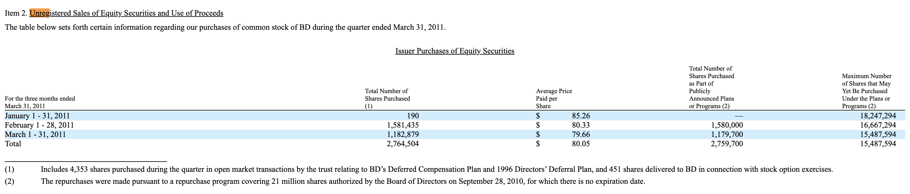

# SEC Repurchase Data Extractor

A sophisticated Python tool for extracting and structuring share repurchase data from SEC 10-Q and 10-K filings. This tool enables researchers to build comprehensive, monthly-frequency repurchase datasets covering all publicly traded companies in the US.

## The Data Gap in Repurchase Research

Traditional repurchase research has relied on two separate datasets that could not be linked: COMPUSTAT, which provides quarterly aggregate repurchase figures, and SDC, which contains repurchase program announcements. COMPUSTAT tells us how many shares a firm repurchased in a given quarter but provides no information about which specific programs these repurchases were conducted under. Conversely, SDC provides announcement dates and program sizes but offers no insight into program completion rates over time.

This disconnection has limited researchers' ability to analyze the relationship between announced programs and actual execution. Beyond this fundamental connectivity issue, the accuracy of commonly used repurchase measures has been questioned. [Banyi et al. (2008)](https://doi.org/10.1016/j.jfineco.2007.07.001) found that COMPUSTAT deviates from actual repurchases reported in SEC filings by more than 30% in approximately 16% of cases.

## What This Tool Delivers

This extractor bridges the gap by providing:

1. **Monthly Repurchase Figures**: Complete monthly breakdowns for all publicly traded companies
2. **Program-Specific Data**: Links repurchases to specific announced programs
3. **Completion Tracking**: Enables analysis of program completion rates over time
4. **Superior Data Quality**: Validation against COMPUSTAT reveals that while 95% of cases match, the remaining 5% show errors of orders of magnitude in COMPUSTAT due to unit misinterpretation (e.g., extracting "300 thousand" as "300"). This tool directly parses SEC filings with proper unit handling, providing more reliable data than existing databases.

## The Academic Impact

This tool enables researchers to:
- Build comprehensive panel datasets of monthly repurchase activity
- Track program completion rates and timing patterns
- Distinguish between different types of repurchase transactions
- Analyze the relationship between program announcements and execution
- Conduct research that was previously impossible due to data limitations

### Research Applications

This tool has been used to create comprehensive repurchase datasets for academic research. For example, [Choubdaran (2024)](https://alichoubdaran.com/uploads/disagreement-horizon.pdf) uses data extracted with this tool to examine the puzzling heterogeneity in completion rates of open market repurchase programs, documenting that low-completion firms significantly outperform analyst expectations in years 1-2 post-announcement, while high-completion firms excel in years 3-4. The study's validation process also revealed systematic errors in COMPUSTAT: in the 5% of cases where the tool's quarterly figures differed from COMPUSTAT, manual verification showed the tool was correct in nearly all instances, with COMPUSTAT errors typically stemming from unit misinterpretation (e.g., failing to recognize that "300" in the table means "300 thousand shares").

## Program Completion Tracking

The tool's unique capability lies in connecting monthly repurchase figures to program authorization details. For example:

- **Program Authorization**: "In July 2024, the Company's Board of Directors authorized a share repurchase program of up to $400.0 million"
- **Monthly Tracking**: January shows $359.7M remaining → $40.3M completed (10% completion rate)
- **Ongoing Analysis**: March shows 200,000 shares at $187.32 → $37.5M additional repurchases
- **Final Balance**: $322.2M remaining → Total completion: 19.5%

This granular tracking enables research questions that were previously impossible to answer due to data limitations.

## Investment and Trading Applications

Beyond academic research, completion tracking has significant implications for investment strategies. [Choubdaran (2024)](https://alichoubdaran.com/uploads/disagreement-horizon.pdf) documents that when firms are divided into quartiles based on their 3-month completion rates, both low-completion (Quartile 1) and high-completion (Quartile 4) firms outperform analyst expectations over a 4-year period—but with distinctly different timing:

- **Low-completion firms**: Outperform in years 1-2 post-announcement
- **High-completion firms**: Outperform in years 3-4 post-announcement

### Enhanced Trading Strategy

This temporal pattern suggests a refinement to the traditional "buyback anomaly" investment strategy. While the classic approach simply holds all announcing firms for 7-48 months post-announcement, a **completion-conditioned strategy** can better align investment horizons with performance timing:

- **For low-completion firms** (Quartile 1): Invest immediately, hold for months 7-24
- **For high-completion firms** (Quartile 4): Delay investment until month 31, hold through month 48

**Performance Results**: The completion-conditioned strategy delivers a monthly alpha of 0.54% versus 0.30% for the classic strategy (difference: 0.25% per month, *p* = 0.038). Over the 42-month trading window, this translates to approximately **11% higher cumulative returns**, even after accounting for higher turnover and trading costs.

**Practical Implementation**: Completion rates are publicly observable from SEC filings and can be mechanically calculated 3 months post-announcement (accounting for filing lags). This makes the strategy implementable in real-world trading, representing an underutilized enhancement to traditional buyback-based investment approaches.

This demonstrates how the tool's data extraction capabilities translate directly into actionable investment strategies with measurable performance improvements.

---

# Technical Documentation

## Understanding SEC Repurchase Tables

SEC regulations (effective March 15, 2004) mandate that firms report monthly share repurchases under Item 2(e) of Form 10-Q and Item 5(c) of Form 10-K. A typical repurchase table looks like this:



### Standard Table Structure

**Rows**: 
- **3 Monthly Intervals**: January, February, March (or the three months of the reporting quarter)
- **1 Total Row**: Quarterly aggregate (sometimes absent; can be calculated from monthly rows)

**Columns** (typically 4):
1. **Total Number of Shares Purchased**: All shares bought back during the period
2. **Average Price Paid Per Share**: Average price for those repurchases
3. **Total Number of Shares Purchased Under Publicly Announced Programs**: Subset of column 1, excluding private transactions
4. **Maximum Dollar Value or Number of Shares Remaining**: Remaining authorization under announced programs

**Context**:
- **Text Above Table** (`soup_before`): Program authorization details, background information
- **Text Below Table** (`soup_after`): Footnotes, program details, explanations

## Key Features

- **Information Preservation**: Captures all data without loss, including missing value context
- **Multi-Table Support**: Handles filings with multiple repurchase programs or transaction types
- **Flexible Output**: Three complementary data sources for comprehensive analysis
- **Research-Grade Quality**: Maintains data integrity for academic and professional research
- **Real-World Robustness**: Handles edge cases and complex filing structures

## Installation

```bash
git clone https://github.com/Ali-Choubdaran/sec-repurchase-extractor.git
cd sec-repurchase-extractor
pip install -r requirements.txt
```

## Quick Start

```python
from src.main import RepurchaseExtractor

# Initialize extractor with SEC filing URL
extractor = RepurchaseExtractor("https://www.sec.gov/Archives/edgar/data/17843/000001784325000011/crs-20250331.htm")

# Extract data (updates instance variables)
extractor.extract()

# Access the three key outputs
soup_before = extractor.soup_before              # Context before table
repurchase_data = extractor.repurchase_data      # Structured table data
soup_after = extractor.soup_after                # Footnotes and context
extraction_metadata = extractor.extraction_metadata  # Extraction diagnostics
```

## Understanding the Output

The extractor provides **four key outputs** that work together to give you complete information:

### 1. `soup_before` - Context Before Table

BeautifulSoup object containing the HTML text immediately preceding the repurchase table. Typically includes:
- Program authorization announcements
- Authorization dates and amounts
- Program descriptions
- Background information

**Usage**:
```python
# Get clean text
context_before = soup_before.get_text(separator=' ', strip=True)
```

### 2. `repurchase_data` - Structured Table Data

A pandas DataFrame containing the cleaned, structured repurchase data. This is the core output.

#### Column Descriptions

| Column | Description | Units |
|--------|-------------|-------|
| `row_label` | Period description or program type label | Text |
| `tot_shares` | Total number of shares purchased | Thousands |
| `avg_price` | Average price paid per share | Dollars (no conversion) |
| `prog_shares` | Shares purchased under publicly announced programs | Thousands |
| `remaining_auth` | Remaining authorization under programs | Millions |
| `id` | Row type identifier (1=Jan, 2=Feb, 3=Mar, 4=Total) | Integer |
| `table_id` | Program/table identifier (for multi-program filings) | Float |
| `table_score` | Program quality score (higher = more likely repurchase program) | Float |
| `beg_date` | Period beginning date | datetime |
| `end_date` | Period ending date | datetime |
| `tot_shares_dollar` | Dollar indicator for `tot_shares` (1=dollar, 0=shares) | Integer |
| `avg_price_dollar` | Dollar indicator for `avg_price` (1=dollar, 0=shares) | Integer |
| `prog_shares_dollar` | Dollar indicator for `prog_shares` (1=dollar, 0=shares) | Integer |
| `remaining_auth_dollar` | Dollar indicator for `remaining_auth` (1=dollar, 0=shares) | Integer |

#### Row Type Identifier (`id`)

- **1, 2, 3**: Monthly intervals (first, second, third month of quarter)
- **4**: Total row for the quarter (if present in original table)

#### Multi-Table Support (`table_id` and `table_score`)

When companies report multiple transaction types (e.g., repurchase programs vs. employee transactions), each type receives a unique `table_id`:
- `table_id = 0` or `1`: Primary repurchase program
- `table_id = 2`: Secondary transactions (often employee-related)

The `table_score` helps identify program quality based on contextual keywords:
- **Positive score**: Keywords like "repurchase", "program", "open market" (+1 each)
- **Negative score**: Keywords like "employee", "compensation", "option" (-1 each)
- Higher scores indicate more likely public repurchase programs

### 3. `soup_after` - Footnotes and Additional Context

BeautifulSoup object containing the HTML text immediately following the table. Typically includes:
- Footnotes explaining table entries
- Program authorization details
- Employee transaction explanations
- Program terms and conditions

**Usage**:
```python
# Get clean text
footnotes = soup_after.get_text(separator=' ', strip=True)
```

### 4. `extraction_metadata` - Extraction Diagnostics

A dictionary containing diagnostic information about the extraction process:
- `num_tables`: Number of tables found in the filing
- `num_monthly_intervals`: Number of monthly intervals identified
- `tot_row_found`: Whether a total row was found (1) or not (0)
- `unit_source`: Where unit information was found (e.g., ['table'])
- `meta_data`: Original column headers from the raw table
- Error tracking fields for debugging

## Data Quality and Standards

### Standardized Units

All monetary and share values are automatically converted to standardized units:

- **`tot_shares`**: Always in **thousands** of shares
- **`avg_price`**: No unit conversion (preserves original precision)
- **`prog_shares`**: Always in **thousands** of shares
- **`remaining_auth`**: Always in **millions** (dollars or shares, indicated by `remaining_auth_dollar`)

The tool automatically detects and converts from the original units (which may be thousands, millions, or billions) to these standardized units.

### Missing Value Notations

The tool preserves information about why data is missing using specific notations:

- **`NaN`**: Originally empty (no content in the cell)
- **`!d`**: Empty after removal of dollar sign (cell had `$` but no number)
- **`!u`**: Empty after removal of unit word (cell had "thousand", "million", "billion" but no number)
- **`!s`**: Empty after removal of star sign (cell had `*` but no number)
- **`!p`** / **`!P`**: Empty after removal of parentheses (mainly due to footnotes)
- **`!o`**: Empty after removal of other meaningless content (like "N/A", "NA", "-", etc.)

These notations help researchers understand the context of missing data and make informed decisions about data usage. The obsession with not throwing away information means every type of "empty" has its own story.

### Date Handling

- **`beg_date`/`end_date`**: Precise date ranges for each period (datetime objects)
- **Monthly intervals**: SEC-required monthly breakdowns (automatically parsed)
- **Quarter totals**: Date range calculated from monthly intervals when total row exists

---

# Real-World Examples

The following examples demonstrate how the tool transforms messy SEC filings into clean, structured data ready for analysis.

## Example 1: CRS (Carpenter Technology) - Q1 2025

### 📥 Raw SEC Filing Input


*This is what researchers typically work with: HTML tables embedded in SEC filings with scattered context and footnotes.*

---

### ✨ Transformed Output

Our tool extracts this messy filing into **three clean, complementary outputs**:

#### 1. 📄 `soup_before` - Context Before Table

```
Item 2. Unregistered Sales of Equity Securities and Use of Proceeds In July 2024, 
the Company's Board of Directors authorized a share repurchase program of up to 
$400.0 million of the Company's outstanding common stock. There is no stated 
expiration for the share repurchase program. The shares may be repurchased from 
time to time at our discretion based on capital needs of the business, general 
market conditions and market price of the stock. The timing or amount of the 
shares to be repurchased cannot be assured. The share repurchase program may be 
discontinued at any time. As of March 31, 2025, $322.2 million of the $400.0 
million remained available for future purchases. During the quarter ended 
March 31, 2025, the Company purchased 200,000 shares pursuant to the terms of 
the share repurchase program. The following table contains information about 
purchases by us of our common stock during the quarter ended March 31, 2025:
```

**Key Information Extracted:**
- 🏢 **Authorization**: $400M program approved in July 2024
- 💰 **Remaining Balance**: $322.2M as of March 31, 2025
- 📊 **Completion Progress**: $77.8M used (19.5% complete)

#### 2. 📊 `repurchase_data` - Structured DataFrame

| row_label | tot_shares | avg_price | prog_shares | remaining_auth | id | table_id | table_score | beg_date | end_date |
|-----------|------------|-----------|-------------|----------------|----|-----------| ------------|----------|----------|
| January 1-31, 2025 | `!o` | `!o` | `!o` | 359.7 | 1.0 | 0.0 | NaN | 2025-01-01 | 2025-01-31 |
| February 1-28, 2025 | `!o` | `!o` | `!o` | 359.7 | 2.0 | 0.0 | NaN | 2025-02-01 | 2025-02-28 |
| March 1-31, 2025 | 200.0 | 187.32 | 200.0 | 322.2 | 3.0 | 0.0 | NaN | 2025-03-01 | 2025-03-31 |
| Quarter ended March 31, 2025 | 200.0 | 187.32 | 200.0 | 322.2 | 4.0 | 0.0 | NaN | 2025-01-01 | 2025-03-31 |

**Data Features:**
- ✅ **Standardized Units**: Shares in thousands (200.0 = 200,000 shares), dollars in millions ($322.2M)
- ✅ **Missing Value Intelligence**: `!o` indicates no repurchases in Jan/Feb (not missing data, but zero activity)
- ✅ **Precise Dates**: Exact date ranges parsed for each period
- ✅ **Total Row**: Quarterly aggregate automatically calculated and dated
- ✅ **Single Program**: `table_id = 0.0` (only one repurchase program in this filing)
- ✅ **No Scoring Needed**: `table_score = NaN` (no competing programs to differentiate)

**Additional Columns** (dollar indicators, not shown above for clarity):
- `tot_shares_dollar`: 0 (shares, not dollars)
- `avg_price_dollar`: 1 (price in dollars)
- `prog_shares_dollar`: 0 (shares, not dollars)
- `remaining_auth_dollar`: 1 (in dollars, specifically $322.2M)

#### 3. 📝 `soup_after` - Footnotes and Additional Context

```
In addition to the share repurchase program, for the quarter ended March 31, 2025, 
1,173 shares, at an average purchase price of $193.50, were surrendered by 
employees to the Company for the payment of the minimum tax liability withholding 
obligations upon the vesting of shares of restricted stock as well as the cost 
obligations of stock options exercised. We do not consider this a share buyback 
program.
```

**Additional Insights:**
- 👥 **Employee Transactions**: 1,173 shares at $193.50 (separate from main program)
- 📋 **Clarity**: Distinguishes between repurchase programs and employee transactions

---

### 🎯 What This Example Demonstrates

1. **Missing Data Intelligence**: The tool correctly identifies that January and February had no repurchases, using `!o` notation rather than treating them as missing data
2. **Context Preservation**: Authorization details from `soup_before` enable completion rate tracking
3. **Clean Structure**: Messy HTML transformed into a pandas DataFrame with meaningful column names
4. **Date Parsing**: Automatic extraction of precise date ranges for each period
5. **Unit Standardization**: Shares in thousands, dollars in millions—ready for analysis

### 💡 Research Use Case

```python
# Calculate program completion
authorized = 400.0  # million
remaining = 322.2   # million
used = authorized - remaining  # $77.8M
completion_rate = used / authorized
print(f"Program completion: {completion_rate:.1%}")  # Output: 19.5%

# Analyze timing
march_data = repurchase_data[repurchase_data['id'] == 3]
shares_repurchased = march_data['tot_shares'].iloc[0] * 1000  # 200,000 shares
avg_price = march_data['avg_price'].iloc[0]  # $187.32
amount_spent = (shares_repurchased * avg_price) / 1e6  # $37.5M
print(f"March spending: ${amount_spent:.1f}M")
```

---

## Example 2: DFS (Discover Financial Services) - Q1 2024

### 📥 Raw SEC Filing Input


*A more complex filing with multiple transaction types reported in the same table.*

---

### ✨ Transformed Output

This example demonstrates the tool's ability to handle **multi-program filings** where each monthly interval has multiple rows for different transaction types.

#### 1. 📄 `soup_before` - Context Before Table

```
Item 2. Unregistered Sales of Equity Securities and Use of Proceeds Issuer 
Purchases of Equity Securities The following table sets forth information 
regarding purchases of our common stock related to our share repurchase program 
and employee transactions made by us or on our behalf during the most recent 
quarter.
```

**Key Information:**
- 🏢 **Two Transaction Types**: Repurchase program and employee transactions
- 📊 **Combined Reporting**: Both types reported in a single table

#### 2. 📊 `repurchase_data` - Structured DataFrame

| row_label | tot_shares | avg_price | prog_shares | remaining_auth | id | table_id | table_score | beg_date | end_date |
|-----------|------------|-----------|-------------|----------------|----|-----------| ------------|----------|----------|
| Repurchase program (1)(4) | `!o` | `!o` | `!o` | 2225.091655 | 1.0 | 1.0 | 2.0 | 2024-01-01 | 2024-01-31 |
| Employee transactions (2) | 3.476 | 107.51 | NaN | NaN | 1.0 | 2.0 | -2.0 | 2024-01-01 | 2024-01-31 |
| Repurchase program (1)(4) | `!o` | `!o` | `!o` | 2225.091655 | 2.0 | 1.0 | 2.0 | 2024-02-01 | 2024-02-29 |
| Employee transactions (2) | 252.279 | 106.89 | NaN | NaN | 2.0 | 2.0 | -2.0 | 2024-02-01 | 2024-02-29 |
| Repurchase program (1)(4) | `!o` | `!o` | `!o` | 2225.091655 | 3.0 | 1.0 | 2.0 | 2024-03-01 | 2024-03-31 |
| Employee transactions (2) | 5.51 | 130.54 | NaN | NaN | 3.0 | 2.0 | -2.0 | 2024-03-01 | 2024-03-31 |
| Repurchase program (1)(4) | `!o` | `!o` | `!o` | 2225.091655 | 4.0 | 1.0 | 2.0 | 2024-01-01 | 2024-03-31 |
| Employee transactions (2) | 261.265 | 107.39 | NaN | NaN | 4.0 | 2.0 | -2.0 | 2024-01-01 | 2024-03-31 |

**Data Features:**
- ✅ **Multi-Table Structure**: 8 rows (2 per monthly interval + 2 total rows)
- ✅ **table_id Separation**: `1.0` for repurchase program, `2.0` for employee transactions
- ✅ **Intelligent Scoring**: `table_score = 2.0` for repurchase program (keywords: "repurchase" +1, "program" +1)
- ✅ **Negative Scoring**: `table_score = -2.0` for employee transactions (keywords: "employee" -1, "transaction" -1)
- ✅ **Flexible Analysis**: Researchers can filter, separate, or combine transaction types as needed

**Additional Columns** (dollar indicators):
- `tot_shares_dollar`: 0 (all in shares)
- `avg_price_dollar`: 1 (prices in dollars)
- `prog_shares_dollar`: 0 (shares)
- `remaining_auth_dollar`: 0 (this company reports remaining auth in shares, not dollars!)

#### 3. 📝 `soup_after` - Footnotes and Additional Context

```
(1) In April 2023, our Board of Directors approved a new share repurchase program 
authorizing the purchase of up to $2.7 billion of our outstanding shares of common 
stock through June 30, 2024. This share repurchase authorization replaced our prior 
$4.2 billion share repurchase program. 

(2) Reflects shares withheld (under the terms of grants under employee stock 
compensation plans) to offset tax withholding obligations that occur upon the 
delivery of outstanding shares underlying restricted stock units or upon the 
exercise of stock options. 

(3) Average price paid per share excludes any excise tax. 

(4) In accordance with the Merger Agreement with Capital One, share repurchases 
have been paused through the completion of the merger. See "— Liquidity and 
Capital Resources — Capital" for additional information.
```

**Critical Insights:**
- 🏢 **Program Details**: $2.7B program authorized in April 2023, expires June 30, 2024
- ⏸️ **Paused Program**: Repurchases paused due to Capital One merger (explains the `!o` values)
- 💰 **Remaining Balance**: $2.225B remaining (only $475M used, 17.6% completion)
- 👥 **Employee Transactions**: 261,265 total shares for employee tax obligations (separate from program)

---

### 🎯 What This Example Demonstrates

1. **Multi-Table Handling**: Automatically separates two transaction types into distinct `table_id` groups
2. **Intelligent Scoring**: Uses contextual keywords to score transaction quality (`table_score`)
3. **Researcher Flexibility**: Different researchers can use the data differently:
   - **Focus on repurchase programs only**: `df[df['table_id'] == 1]`
   - **Study employee transactions**: `df[df['table_id'] == 2]`
   - **Analyze total activity**: Use both tables combined
4. **Context Preservation**: Footnotes explain why repurchases were paused (merger) and program details
5. **Missing Value Intelligence**: `!o` indicates no repurchases (program paused), while employee transactions continued

### 💡 Research Use Cases

```python
# Separate transaction types
repurchase_program = repurchase_data[repurchase_data['table_id'] == 1.0]
employee_transactions = repurchase_data[repurchase_data['table_id'] == 2.0]

# Analyze employee transactions only
total_employee_shares = employee_transactions[employee_transactions['id'] == 4]['tot_shares'].iloc[0]
avg_employee_price = employee_transactions[employee_transactions['id'] == 4]['avg_price'].iloc[0]
print(f"Employee transactions: {total_employee_shares * 1000:,.0f} shares at ${avg_employee_price:.2f}")
# Output: Employee transactions: 261,265 shares at $107.39

# Track program status (no actual repurchases this quarter)
program_remaining = repurchase_program[repurchase_program['id'] == 4]['remaining_auth'].iloc[0]
authorized = 2700.0  # $2.7B from footnotes (but remaining_auth is in shares here!)
print(f"Program status: {program_remaining:,.0f} shares remaining")

# Filter by transaction quality
high_quality = repurchase_data[repurchase_data['table_score'] > 0]  # Only repurchase programs
print(f"High-quality repurchase rows: {len(high_quality)}")
```

### 🔍 Key Insight: Program Paused

The combination of `!o` values for the repurchase program and the footnote explaining the Capital One merger provides crucial context. Without the footnote, one might misinterpret the lack of repurchases. This demonstrates the power of combining `soup_after` with `repurchase_data` for complete understanding.

---

## Error Handling

The tool provides detailed error information through the `extraction_metadata`:

```python
# Check extraction status
if extractor.extraction_metadata.get('self_term_re') == 'not_3_monthly_intervals':
    print("Could not identify 3 monthly intervals")
elif extractor.extraction_metadata.get('error_term_re'):
    print(f"Error: {extractor.extraction_metadata['error_term_re']}")
else:
    print("Extraction successful")
```

## License

This project is licensed under the MIT License - see the LICENSE file for details.

## Citation

If you use this tool in your research, please cite both the tool and the underlying research:

```bibtex
% Cite the research methodology
@unpublished{choubdaran2025disagreement,
  author = {Choubdaran, Ali},
  title = {Disagreement Resolution Horizon and Open Market Repurchase Program Completion},
  year = {2025},
  note = {PhD Thesis Chapter, London School of Economics. Available at: \url{https://alichoubdaran.com/uploads/disagreement-horizon.pdf}}
}

% Cite the tool
@software{sec_repurchase_extractor,
  author = {Choubdaran, Ali},
  title = {SEC Repurchase Data Extractor},
  year = {2025},
  url = {https://github.com/Ali-Choubdaran/sec-repurchase-extractor}
}
```

## Support

For questions, issues, or feature requests, please open an issue on GitHub or contact the development team.

## References

- Banyi, M. L., Dyl, E. A., & Kahle, K. M. (2008). Errors in estimating share repurchases. *Journal of Corporate Finance*, 14(4), 460-474.
- Choubdaran, A. (2025). Disagreement Resolution Horizon and Open Market Repurchase Program Completion. PhD Thesis Chapter, London School of Economics. Available at: https://alichoubdaran.com/uploads/disagreement-horizon.pdf
